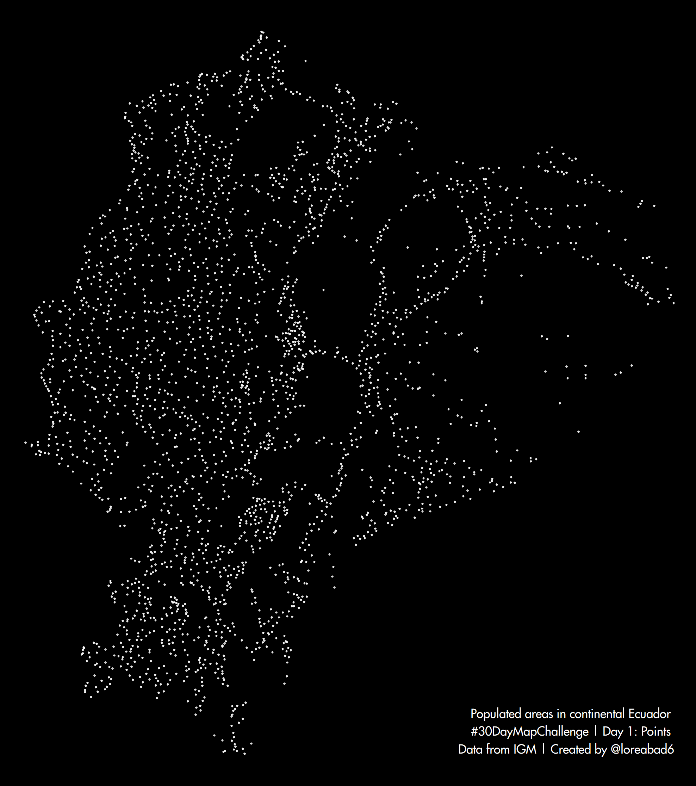
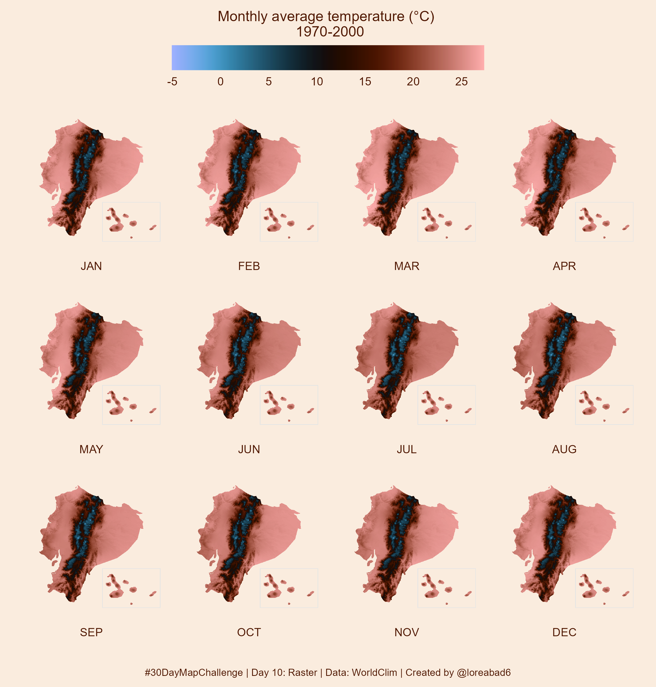
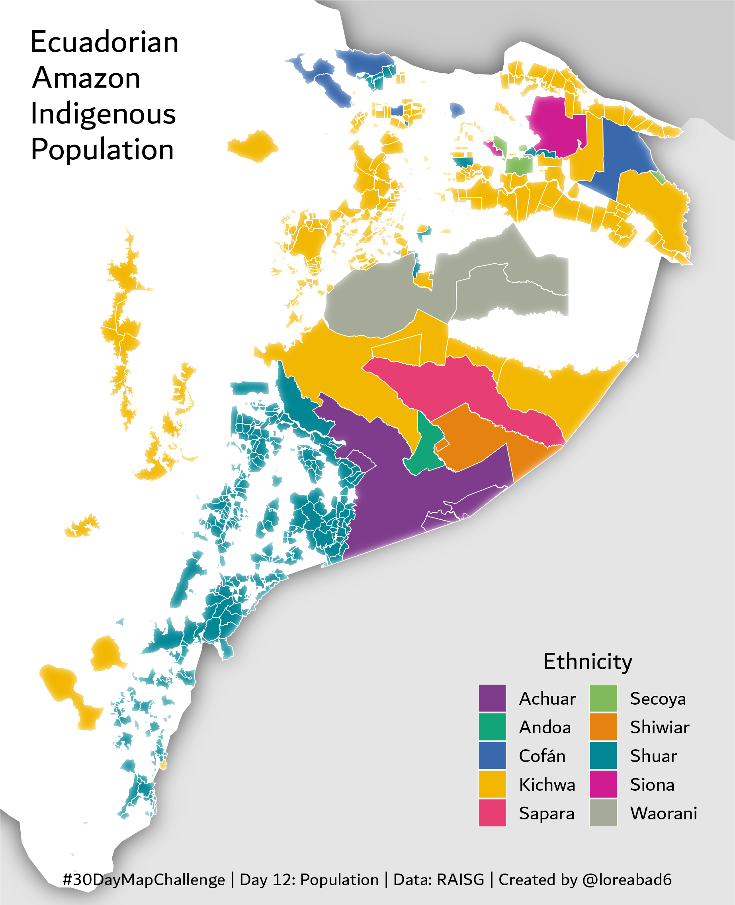
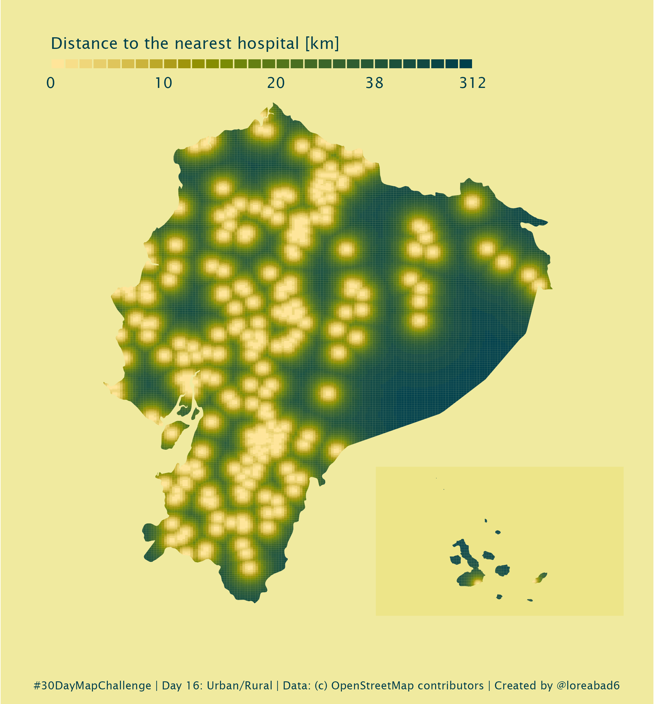
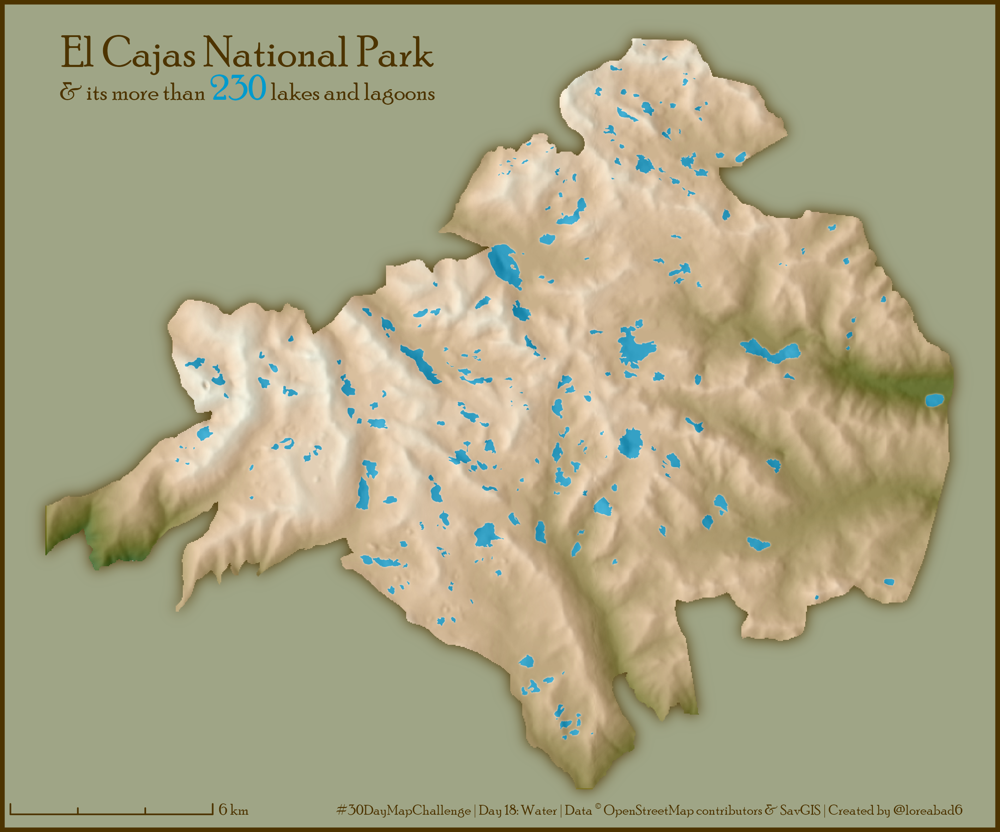
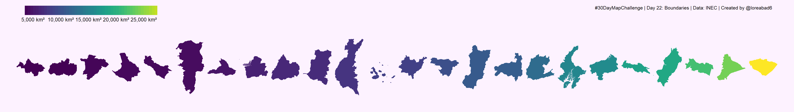
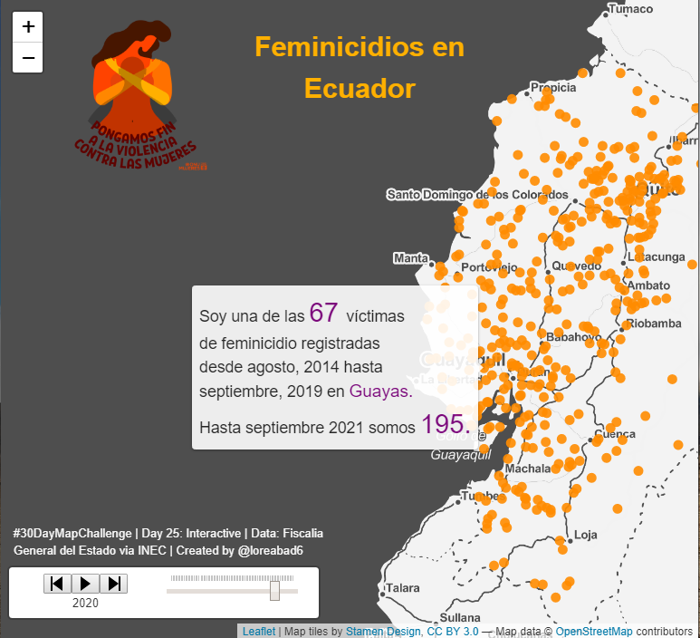
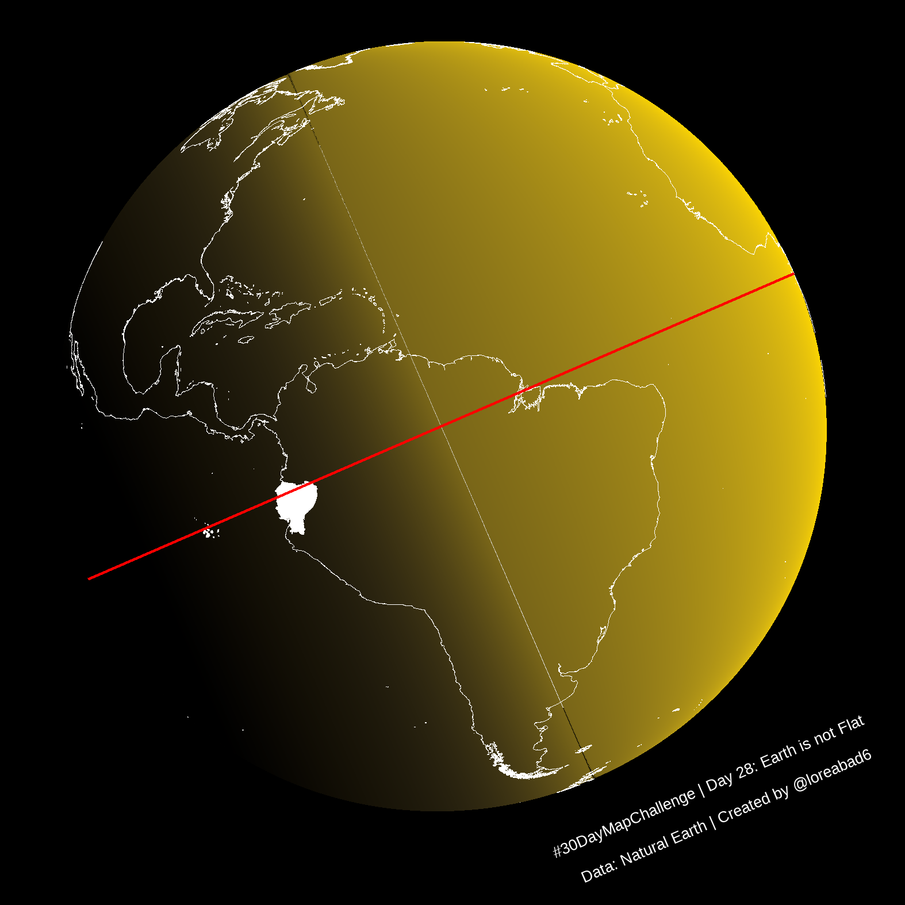

# #30DayMapChallenge

  <a href="https://raw.githubusercontent.com/loreabad6/30DayMapChallenge/main/maps/day01.png"><a />
  <a href="https://raw.githubusercontent.com/loreabad6/30DayMapChallenge/main/maps/day02.png"><a />
  <a href="https://raw.githubusercontent.com/loreabad6/30DayMapChallenge/main/maps/day03.png"><a />
  <a href="https://raw.githubusercontent.com/loreabad6/30DayMapChallenge/main/maps/day04.png"><a />
  <a href="https://raw.githubusercontent.com/loreabad6/30DayMapChallenge/main/maps/day05.png"><a />
  <a href="https://raw.githubusercontent.com/loreabad6/30DayMapChallenge/main/maps/day06.png"><a /> 
  <a href="https://raw.githubusercontent.com/loreabad6/30DayMapChallenge/main/maps/day07.png"><a /> 
  <a href="https://raw.githubusercontent.com/loreabad6/30DayMapChallenge/main/maps/day08.png"><a /> 
  <a href="https://raw.githubusercontent.com/loreabad6/30DayMapChallenge/main/maps/day09.png"><a /> 
  <a href="https://raw.githubusercontent.com/loreabad6/30DayMapChallenge/main/maps/day10.png"><a /> 
  <a href="https://raw.githubusercontent.com/loreabad6/30DayMapChallenge/main/maps/day11.png"><a /> 
  <a href="https://raw.githubusercontent.com/loreabad6/30DayMapChallenge/main/maps/day12.png"><a /> 
  <a href="https://raw.githubusercontent.com/loreabad6/30DayMapChallenge/main/maps/day13.png"><a /> 
  <a href="https://raw.githubusercontent.com/loreabad6/30DayMapChallenge/main/maps/day14.png"><a /> 
  <a href="https://raw.githubusercontent.com/loreabad6/30DayMapChallenge/main/maps/day15.jpg"><a /> 
  <a href="https://raw.githubusercontent.com/loreabad6/30DayMapChallenge/main/maps/day16.png"><a /> 
  <a href="https://raw.githubusercontent.com/loreabad6/30DayMapChallenge/main/maps/day17.png"><a /> 
  <a href="https://raw.githubusercontent.com/loreabad6/30DayMapChallenge/main/maps/day18.png"><a /> 
  <a href="https://raw.githubusercontent.com/loreabad6/30DayMapChallenge/main/maps/day19.png"><a /> 
  <a href="https://raw.githubusercontent.com/loreabad6/30DayMapChallenge/main/maps/day20.png"><a /> 
  <a href="https://raw.githubusercontent.com/loreabad6/30DayMapChallenge/main/maps/day21.png"><a /> 
  <a href="https://raw.githubusercontent.com/loreabad6/30DayMapChallenge/main/maps/day22.png"><a /> 
  <a href="https://raw.githubusercontent.com/loreabad6/30DayMapChallenge/main/maps/day23.png"><a /> 
  <a href="https://raw.githubusercontent.com/loreabad6/30DayMapChallenge/main/maps/day24.png"><a /> 
  <a href="https://loreabad6.github.io/30DayMapChallenge/web/day25.html"><a /> 
  <a href="https://raw.githubusercontent.com/loreabad6/30DayMapChallenge/main/maps/day26_revised.png"><a /> 
  <a href="https://raw.githubusercontent.com/loreabad6/30DayMapChallenge/main/maps/day27.png"><a /> 
  <a href="https://raw.githubusercontent.com/loreabad6/30DayMapChallenge/main/maps/day28.png"><a /> 
  <a href="https://raw.githubusercontent.com/loreabad6/30DayMapChallenge/main/maps/day29.png"><a /> 

